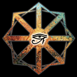
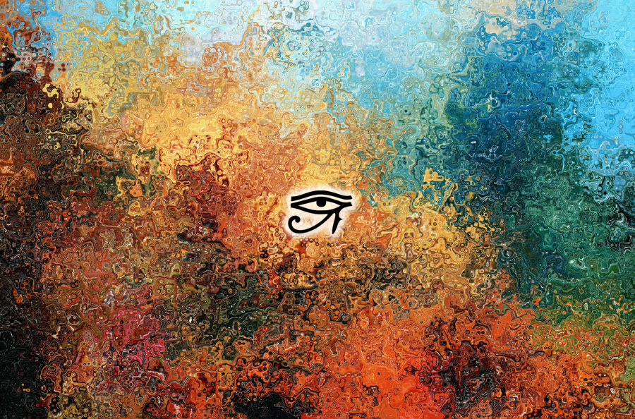

# Chaos Star Generator

<p align="center">
  
</p>

<p align="center">
  <strong>Generate, customize, and share procedurally-drawn chaos stars.</strong><br>
  <em>Eight arrows radiating from a center — endless variations of color, geometry, and rotation.</em>
</p>

<p align="center">
  <a href="https://caostar.com/">Live</a> · 
  <a href="https://caostar.com/thoughts/the-chaos-star-generator-revamped/2026/05/">About the project</a>
</p>

---

## Features

- 🎛 **Full geometric control** — bar width/length/taper, tip width/length/notch, center radius, global scale
- 🎨 **Multi-stop gradients** — angular (conic), linear, radial, or solid; auto-wrapping seam for smooth angular fills
- 🖼 **28 sample textures + custom upload** — any bitmap can fill the star, drag to position, scale to taste
- ✨ **Inspire mode** — random designs in a smooth GSAP-powered loop, configurable transition speed
- 🔗 **Shareable URLs** — every parameter round-trips through `?design=` (compressed base64)
- ⏪ **Browser history** — every commit is a back/forward navigable state with a smooth transition
- 💾 **PNG export** with transparent or solid background
- 📱 **Mobile native** — pinch zoom, drag-to-pan textures, long-press to save to Photos, "Add to Home Screen"

## Magickal use

Beyond being a creative tool, the Chaos Star Generator can also serve as a magickal instrument. Here's a fun experiment:

1. Upload a texture with a sigil placed at the exact center of the image. Like this one, included on the sample textures:

   

2. Click on **Inspire me randomly** or just hit "R".
3. Adjust the **Transition** parameter to set your preferred speed.
4. Enter into a state of gnosis and focus on the moving Chaos Star while keeping your sigil in view.
5. Boom. You've just created a powerful ritual moment.

## Quick start

It's a static site — no build step.

```bash
# any static server works
python3 -m http.server 8000
# then open http://localhost:8000
```

ES modules require a real HTTP server; `file://` won't work.

## Controls

### Keyboard

| Key | Action |
|---|---|
| `Space` | Generate a new random star |
| `R` | Toggle inspire loop |
| `F` | Full screen |
| `H` | Hide all controls |
| `Esc` | Exit fullscreen / stop inspire |
| `⌘ ±` / `⌘ 0` | Zoom star in / out / reset |
| Wheel | Zoom star |

### Mouse / touch

| Gesture | Action |
|---|---|
| Tap / click canvas | Random star |
| Hold canvas (mobile) | Open share sheet → Save to Photos |
| Hold canvas (desktop) | Download PNG |
| Pinch | Zoom star |
| Drag canvas (in Texture Drag Mode) | Pan the texture |

## Tech

- Pure HTML / CSS / vanilla JS (ES modules)
- `<canvas>` 2D API for all rendering — `createConicGradient`, `createLinearGradient`, `createRadialGradient`
- [GSAP 3](https://gsap.com/) for parameter tweening
- IndexedDB for custom-texture persistence
- Web Share API for mobile save-to-photos
- No build step, no framework, no bundler

## Project layout

```
index.html                          ← entry point
manifest.webmanifest                ← PWA manifest
favicon.ico
chaos-star-generator-files/
  css/styles.css
  js/
    main.js                         ← bootstrap, UI wiring, keyboard, gestures
    star-renderer.js                ← canvas geometry + gradient/texture fill
    parameters.js                   ← param defs, defaults, random generator
    animation.js                    ← Tweener wrapping GSAP for params
    gradient-editor.js              ← multi-stop gradient widget
    texture-manager.js              ← sample list, IDB cache, image loading
    url-codec.js                    ← base64-encoded design state in URL + history
    export.js                       ← (legacy, unused)
  assets/                           ← icons + splash
  textures/                         ← 28 sample textures (.jpg)
```

## URL sharing

Every parameter — geometry, gradient stops, gradient type, background, sample texture choice, texture position/scale — is encoded into a compact base64 JSON blob in `?design=`. Open the same URL anywhere and you get the same star.

**Custom uploaded textures** are too large to fit in a URL, so they're stored locally in IndexedDB. The URL marks `tm=custom` so opening a shared link with a custom texture in someone else's browser falls back to no texture with a notice.

## Add to home screen

Manifest is configured for installable PWA — open in Safari/Chrome on mobile, "Add to Home Screen", and it launches chromeless against a black splash.

## Credits

Inspired by the original [caostar.com](https://caostar.com/thoughts/the-chaos-star-generator/2013/03/) by AD. This is a from-scratch reimplementation.

The Symbol of Chaos itself was popularized by Michael Moorcock in his Eternal Champion novels and adopted by chaos magicians from the 1970s onward — eight arrows radiating from a single point, representing chaos as the source of all possibility.

## License

This repository is under the Do What The Fuck You Want To Public License [WTFPL](https://caostar.com/thoughts/the-chaos-star-generator/2013/03/)

